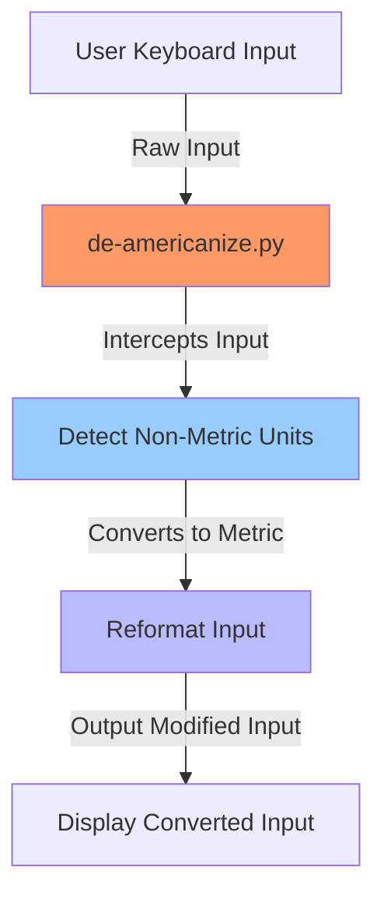

# De-Americanize

This program listens to your keyboard in real-time and automatically converts measurements from feet and inches to millimeters when you type them in a specific format, like 5'8/. Here's how it works, step by step:

Key Listening: The program monitors every key you press on the keyboard and stores them in a small memory buffer (up to 10 characters).
Detecting Input: It looks for an input pattern where you type something like = followed by a feet and inches value (e.g., 5'8/). When it detects this pattern, it knows you are entering a height measurement.
Conversion: It takes the feet and inches you typed, converts them into millimeters, and rounds the result to two decimal places.
Automatic Replacement: The program deletes the original feet and inches you typed and replaces them with the corresponding value in millimeters, adding "mm" at the end.
For example, if you type =5'8/, the program will replace it with 1727.2 mm automatically.

This all happens in the background while you are typing, making the conversion quick and seamless.